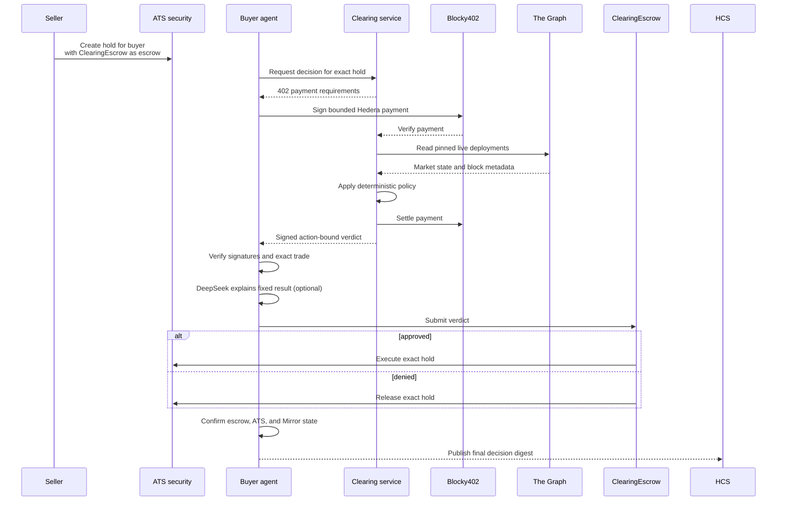

# The Conformance Desk

A paid, signed clearing decision for ATS-issued private-credit fund units. A seller locks an exact
trade in an ATS hold, a buyer agent pays for live market checks through Hedera x402, and a contract
escrow either executes that hold or releases it. The deterministic policy is authoritative;
DeepSeek can explain the result but cannot sign, settle, or change it.

## Architecture



The seller service and buyer agent are separate processes and hold different credentials.
`packages/service` never exposes its Graph key or raw Graph rows. `packages/agent` never receives
Graph credentials, issuer powers, or custody of the held units.

## Packages

| Path | Purpose |
| --- | --- |
| `packages/signal` | Pure checks, catalog, Graph clients, canonical JSON, signing, HCS digest |
| `packages/evaluator` | Live six-deployment Graph + MCP evaluator; returns derived evidence only |
| `packages/service` | Free health endpoint and x402-protected signed verdict endpoint |
| `packages/agent` | Buyer agent, provider-neutral explanation, authorization submission, and HCS anchoring |
| `packages/cli` | Signature-verifying paid consumer |
| `packages/mcp-server` | `get_conformance_verdict` reusable MCP tool |
| `contracts` | `ClearingEscrow`, which verifies action-bound verdicts and settles exact ATS holds |
| `scripts` | Dry-run-first issuance, lifecycle, scheduling, sweep, replay, deploy and verify tools |

## Setup

Requirements: Node.js 22+, npm 10+, and Foundry.

```bash
npm ci --ignore-scripts
cp .env.example .env
npm run check
```

Fill `.env` locally; never commit it. The seller requires `GRAPH_STUDIO_KEY`,
`VERDICT_SIGNER_KEY`, `X402_PAY_TO`, and the x402 settings. The preferred paid-consumer path uses
`PRIVY_APP_ID`, `PRIVY_APP_SECRET`, `PRIVY_WALLET_ID`, and a Hedera account associated with that
wallet's ECDSA public key. A local ECDSA `HEDERA_OPERATOR_KEY` remains available for development.
Optional explanations require
`DEEPSEEK_API_KEY` and an explicit `DEEPSEEK_MODEL`; clearing still fails closed from deterministic
checks when those values are absent. Live settlement also requires the ATS security, hold, HCS
topic, and deployed escrow identifiers.

Start the seller and call the CLI in separate shells:

```bash
npm run start:service
npm start --workspace @desk/cli -- check aave-v3 base D7mapexM5ZsQckLJai2FawTKXJ7CqYGKM8PErnS3cJi9 --lag 50
```

Every mutating script is a dry run unless passed the explicit execute flag. Review its JSON before
running the live form:

```bash
node scripts/issue-equity.cjs
node scripts/run-caretaker.cjs
node scripts/run-caretaker.cjs --execute
```

## Settlement and trust boundaries

- The seller creates an ATS hold naming the buyer, amount, expiry, and `ClearingEscrow`. Held units
  cannot be double-spent while the decision is pending.
- Only a complete, unexpired, correctly signed authorization can make `ClearingEscrow` execute or
  release that exact hold. Changed fields, wrong signers, and reused nonces revert.
- The DeepSeek explanation consumes derived checks only and cannot override the deterministic
  action. Missing model credentials disable the explanation path, not the policy decision.
- x402 requirements are pinned to `hedera:testnet`, exact scheme, Circle testnet USDC `0.0.429274`,
  Blocky fee payer `0.0.7162784`, the configured seller, and a buyer-side spend cap.
- Payment is verified before Graph work and settled after evaluation; settlement failure returns no
  verdict.
- Contract execution is authoritative. HCS anchoring happens after finality and is reported as
  degraded when unavailable rather than being confused with settlement.

## Honest platform limits

- ATS is ERC-1400 with partial ERC-3643 support. Bond coupons are accounting lifecycle operations;
  they do not transfer money.
- Circle testnet USDC's fee schedule cannot be changed by this project. `scripts/hts-fees.cjs`
  creates a separate demonstration HTS token and is not claimed to be the x402 settlement asset.
- HIP-423 creates a one-shot scheduled HCS marker. It does not recur and cannot invoke an HTTP
  agent; an external scheduler must create future wakes.
- ATS v8 omits several declared values from its CommonJS entry point. This repository pins audited
  role hashes and uses the documented structural node configuration, but those paths still require
  live testnet proof.
- The pinned ATS dependency currently brings transitive npm audit findings, including critical
  findings in `protobufjs` and `tar`. `npm audit fix --force` proposes an incompatible ATS downgrade,
  so it has not been applied. Do not expose the ATS process to untrusted protobuf schemas or archives.

## Verification status

Offline validation currently covers signal calculation/signatures, seller payment ordering, CLI/MCP
verification, agent authority checks, script dry runs, and Solidity signature/replay guards.
The Graph sweep has also been exercised live against all six pinned deployments, but its redacted
evidence remains local. This does **not** prove a Blocky402 settlement, ATS issuance, HCS message, HTS token,
scheduled transaction, clearing-escrow deployment, Sourcify verification, or HashScan result. Those
require the testnet credentials and IDs in `.env`. Follow the evidence-driven [end-to-end test
plan](docs/E2E.md) before making any live-system claim.

Primary references: [Hedera ATS](https://docs.hedera.com/solutions/tokenization/ats),
[Hedera x402](https://docs.hedera.com/solutions/ai/x402),
[The Graph Subgraph MCP](https://thegraph.com/docs/en/ai-suite/subgraph-mcp/introduction/), and
[Messari standardized subgraphs](https://github.com/messari/subgraphs).
