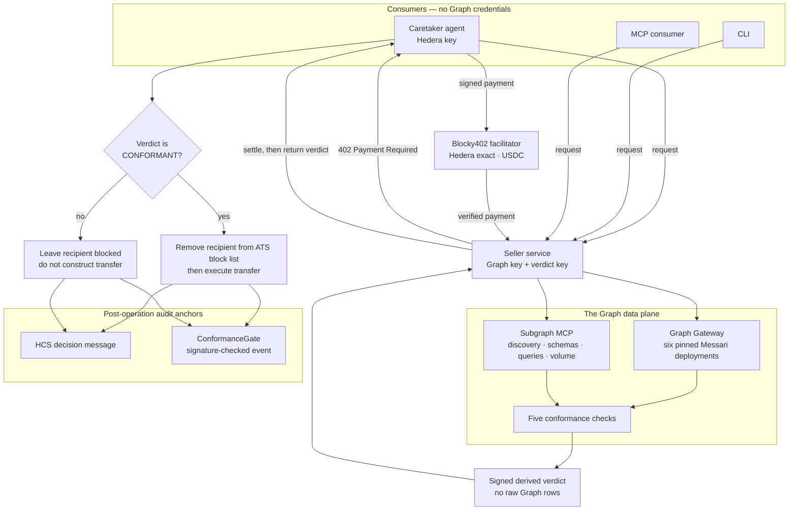

# The Conformance Desk

A paid, signed conformance verdict that authorizes—or structurally refuses—a regulated token
operation. The seller reads live Messari Lending v3.1 deployments through The Graph, the caretaker
pays through Hedera x402, and an ATS control list makes a failed verdict revert at the token layer.

This repository intentionally contains no frontend. The terminal, signed verdict, HashScan records,
HCS topic, and Mirror Node replay are the demo surface.

## Architecture



The seller and buyer are separate processes and hold different credentials. `packages/service`
never exposes its Graph key or raw Graph rows. `packages/agent` never receives Graph credentials.

## Packages

| Path | Purpose |
| --- | --- |
| `packages/signal` | Pure checks, catalog, Graph clients, canonical JSON, signing, HCS digest |
| `packages/evaluator` | Live six-deployment Graph + MCP evaluator; returns derived evidence only |
| `packages/service` | Free health endpoint and x402-protected signed verdict endpoint |
| `packages/agent` | CommonJS caretaker, Anthropic reasoning, ATS action/refusal, HCS/gate anchors |
| `packages/cli` | Signature-verifying paid consumer |
| `packages/mcp-server` | `get_conformance_verdict` reusable MCP tool |
| `contracts` | Foundry contract that verifies verdict signatures and rejects replay |
| `scripts` | Dry-run-first issuance, lifecycle, scheduling, sweep, replay, deploy and verify tools |

## Setup

Requirements: Node.js 22+, npm 10+, and Foundry.

```bash
npm ci --ignore-scripts
cp .env.example .env
npm run check
```

Fill `.env` locally; never commit it. The seller requires `GRAPH_STUDIO_KEY`,
`VERDICT_SIGNER_KEY`, `X402_PAY_TO`, and the x402 settings. The paid consumers require the ECDSA
`HEDERA_OPERATOR_ID` and `HEDERA_OPERATOR_KEY`. The live caretaker additionally requires an
explicit `ANTHROPIC_MODEL`, recipient/security IDs, an HCS topic, and the deployed gate address.

Start the seller and call the CLI in separate shells:

```bash
npm run start:service
npm start --workspace @desk/cli -- check aave-v3 base D7mapexM5ZsQckLJai2FawTKXJ7CqYGKM8PErnS3cJi9 --lag 50
```

Every mutating script is a dry run unless passed the explicit execute flag. Review its JSON before
running the live form:

```bash
node scripts/issue-equity.cjs
node scripts/run-caretaker.cjs
node scripts/run-caretaker.cjs --execute
```

## Refusal and trust boundaries

- Only a signed `CONFORMANT` verdict can cause the caretaker to remove a recipient from the ATS
  block list. Every other verdict leaves the recipient blocked, so the transfer is never built.
- The Anthropic reasoning step explains the signed result but cannot override it. A conflicting
  model recommendation fails before any mutation.
- x402 requirements are pinned to `hedera:testnet`, exact scheme, Circle testnet USDC `0.0.429274`,
  Blocky fee payer `0.0.7162784`, the configured seller, and a buyer-side spend cap.
- Payment is verified before Graph work and settled after evaluation; settlement failure returns no
  verdict.
- HCS and `ConformanceGate` anchoring happen after the ATS outcome and are not atomic with it.
  Partial anchor failures are reported as executed/refused-but-unanchored, never as success.

## Honest platform limits

- ATS is ERC-1400 with partial ERC-3643 support. Bond coupons are accounting lifecycle operations;
  they do not transfer money.
- Circle testnet USDC's fee schedule cannot be changed by this project. `scripts/hts-fees.cjs`
  creates a separate demonstration HTS token and is not claimed to be the x402 settlement asset.
- HIP-423 creates a one-shot scheduled HCS marker. It does not recur and cannot invoke an HTTP
  agent; an external scheduler must create future wakes.
- ATS v8 omits several declared values from its CommonJS entry point. This repository pins audited
  role hashes and uses the documented structural node configuration, but those paths still require
  live testnet proof.
- The pinned ATS dependency currently brings transitive npm audit findings, including critical
  findings in `protobufjs` and `tar`. `npm audit fix --force` proposes an incompatible ATS downgrade,
  so it has not been applied. Do not expose the ATS process to untrusted protobuf schemas or archives.

## Verification status

Offline validation currently covers signal calculation/signatures, seller payment ordering, CLI/MCP
verification, caretaker refusal/compensation, script dry runs, and Solidity signature/replay guards.
It does **not** prove a live Graph query, Blocky402 settlement, ATS issuance, HCS message, HTS token,
scheduled transaction, contract deployment, Sourcify verification, or HashScan result. Those require
the testnet credentials and IDs in `.env`.

Primary references: [Hedera ATS](https://docs.hedera.com/solutions/tokenization/ats),
[Hedera x402](https://docs.hedera.com/solutions/ai/x402),
[The Graph Subgraph MCP](https://thegraph.com/docs/en/ai-suite/subgraph-mcp/introduction/), and
[Messari standardized subgraphs](https://github.com/messari/subgraphs).
