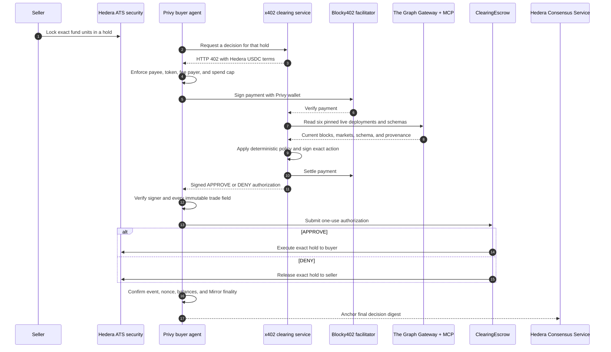

# The Conformance Desk

The Conformance Desk autonomously clears ATS-issued private-credit fund units. A seller locks one
exact trade in an Asset Tokenization Studio hold. A Privy-controlled buyer agent pays a Hedera x402
endpoint for a live, standardized market-data check. A signed decision then makes
`ClearingEscrow` execute or release that hold, then attempts to anchor the final digest to Hedera
Consensus Service.

There is no simulated success path. The UI reads the durable result of this workflow and only
publishes a trade after the x402 payment, contract event, ATS balance change, and Mirror Node result
have all been confirmed.

## Why this exists

Tokenizing an asset is only the first step. Private-market counterparties still need to know whether
the data source is healthy enough to execute an exact transfer now. The Desk turns that question
into a paid machine-to-machine service with a bounded buyer, reproducible live evidence, and an
on-chain action that cannot be redirected to another trade.

## Architecture



The seller and buyer are separate processes with separate credentials. The seller never exposes its
Graph key or raw provider rows. The buyer receives no issuer role and cannot change the asset,
parties, amount, hold, policy, or action after the verdict is signed. DeepSeek is optional
presentation: it can explain the fixed result, but it cannot decide, sign, pay, or settle.

## Sponsor integrations and qualification status

Requirements are from the current
[ETHOnline 2026 prize page](https://ethglobal.com/events/ethonline2026/prizes). Code links are pinned
to a merged commit so the evidence cannot move during judging.

### Hedera — AI & Agentic Payments

| Requirement | Implementation | Status | Code |
| --- | --- | --- | --- |
| Live x402 service on Hedera through Blocky402 | `/verdict` registers the exact Hedera scheme with Blocky402 and Circle testnet USDC; no valid payment means no evaluation or verdict. | **Pending:** locally running; public hosting and a paid request remain | [payment gate][loc-x402-server] |
| Agent completes a real paid request | The buyer enforces network, payee, asset, Blocky fee payer, and spend cap before signing; the caretaker uses that paid fetch. | **Pending:** buyer needs faucet USDC | [bounded buyer][loc-x402-buyer], [wiring][loc-caretaker-pay] |
| Public source and payment-flow docs | This README documents setup, architecture, and the runnable payment flow. | **Pending:** repository is private until the final publication step | This document |
| Five-minute-or-less paid-request demo | The demo uses the caretaker and only passes after the facilitator transaction and settlement are confirmed. | **Pending:** record after the paid run | [payment to finality][loc-caretaker-finality] |

Hedera is also the execution and audit layer: the ATS hold prevents double-spending, the escrow
consumes a one-use authorization, and the agent attempts to record the final digest on HCS after
settlement. An HCS outage degrades audit metadata but cannot reverse or duplicate settlement.

### Hedera — Tokenization of Anything

| Requirement | Implementation | Status | Code |
| --- | --- | --- | --- |
| Use ATS to issue or manage a tokenized asset | ATS issues `Spokane Private Credit Fund` units, configures regulation metadata and roles, seeds the seller, and creates an escrow-bound hold. | **Complete on testnet** | [issuance][loc-ats-issue], [hold][loc-ats-hold] |
| Deploy and demonstrate on Hedera testnet | The security, clearing escrow, parties, and restricted HCS topic are deployed on testnet; public links are below. | **Complete on testnet** | [escrow][loc-escrow] |
| Public repo and verified contracts where applicable | Contract source is included and Sourcify exactly matches both creation and runtime bytecode. | **Source verified;** public switch pending | [contract source][loc-escrow] |
| Show issuance, configuration, and a lifecycle operation | The approved lifecycle executes the ATS hold after a paid verdict; the caretaker verifies the exact seller/buyer balance delta. | **Pending:** final hold execution awaits paid run | [finality assertions][loc-caretaker-finality] |

This is a secondary-market clearing use case, not a decorative token. ATS supplies issuance,
ownership, roles, and the hold lifecycle; the Desk adds paid market-data assurance and atomic
execution for an exact off-exchange transfer.

### The Graph — Composable or Standardized Graph Products

| Requirement | Implementation | Status | Code |
| --- | --- | --- | --- |
| Compose products or build on a standardized schema | One Messari Lending v3.1 query spans Aave, Compound, Morpho, and Spark across six pinned deployments; Gateway reads compose with Subgraph MCP schema, discovery, and query-count calls. | **Complete; live-validated** | [catalog][loc-graph-catalog], [evaluator][loc-graph-evaluator] |
| Consume live provider data; no mock/static dataset | The evaluator calls The Graph Gateway and live Subgraph MCP at request time, validates deployment metadata, and fails closed. | **Complete; live-validated** | [live evaluator][loc-graph-evaluator], [MCP transport][loc-graph-mcp] |
| Make standards leverage clear | One policy checks schema compatibility, indexing health, freshness, and market values without protocol-specific query branches. | **Complete** | [shared decision][loc-graph-decision] |
| Public repo and two-to-four-minute demo | Source and the runnable path are documented here; the video will show live block metadata in the paid clearing run. | **Pending:** public switch and video | [MCP tool][loc-desk-mcp] |

### The Graph — Best AI Tooling or AI Use Case (From Scratch)

| Requirement | Implementation | Status | Code |
| --- | --- | --- | --- |
| The Graph is load-bearing | No Graph evidence means no signed verdict and therefore no escrow settlement. | **Complete** | [service boundary][loc-service-boundary] |
| Do meaningful work with live data | The service derives five checks and an APPROVE/DENY action instead of printing raw rows. | **Complete; live-validated** | [decision][loc-graph-decision] |
| Reusable tooling | `get_conformance_verdict` exposes the paid, signature-verifying flow as an MCP tool with a strict trade schema. | **Complete** | [MCP server][loc-desk-mcp] |
| Open source and correct pool | This project was built from scratch for ETHOnline 2026. Setup and verification are below. | **Pending:** public switch and video | This document |

### Privy — Best Financial Flow

| Requirement | Implementation | Status | Code |
| --- | --- | --- | --- |
| Privy is core and at least one wallet is used | The buyer is a Privy Ethereum server wallet paired to a Hedera ECDSA account; its payment key is never exported into the app. | **Complete; live raw-sign validated** | [wallet client][loc-privy-client] |
| Functional flow using a generally available feature | Privy's wallet RPC signs each Hedera transaction-body hash used by the x402 USDC transfer. | **Pending:** funded Blocky402 transfer | [Hedera signer][loc-privy-signer], [caretaker selection][loc-caretaker-pay] |
| Working demo and source | The caretaker performs payment, decision, ATS settlement, and audit anchoring. | **Pending:** paid run, public switch, and video | [end-to-end caretaker][loc-caretaker-finality] |
| Explain Privy's UX improvement | The agent pays from a managed wallet without exposing the Privy payment key, while local limits remain enforced. | **Complete** | [bounded policy][loc-x402-buyer] |

## Live testnet resources

| Resource | Evidence |
| --- | --- |
| ATS equity security — `0.0.10506353` | [HashScan](https://hashscan.io/testnet/contract/0.0.10506353) |
| ClearingEscrow — `0.0.10506286` | [HashScan](https://hashscan.io/testnet/contract/0.0.10506286) · [Sourcify exact match](https://sourcify.dev/server/v2/contract/296/0x5D6Ee3b3f1f28872041F104ba4709Ac3a4fE4439) |
| Restricted audit topic — `0.0.10506273` | [HashScan](https://hashscan.io/testnet/topic/0.0.10506273) |
| Privy-controlled buyer — `0.0.10506237` | [HashScan](https://hashscan.io/testnet/account/0.0.10506237) |

These links prove resource existence, not the final paid demo. The final payment transaction,
`HoldSettled` event, ATS balance delta, and HCS sequence number must come from one completed run.

## Run locally

Requirements: Node.js 22+, npm 10+, and Foundry.

```bash
npm ci --ignore-scripts
test -f .env || cp .env.example .env
npm run check
```

Fill `.env` locally; never commit it. Required live values are documented in `.env.example`. The
preferred buyer uses `PRIVY_APP_ID`, `PRIVY_APP_SECRET`, `PRIVY_WALLET_ID`, and
`PRIVY_HEDERA_ACCOUNT_ID`. DeepSeek credentials are optional and only enable an explanation.

Start the API and visual dashboard in separate shells:

```bash
npm run start:service
npm run dev --workspace @desk/web
```

Every mutation is dry-run-first. Inspect the JSON before adding `--execute`:

```bash
node --env-file=.env scripts/issue-equity.cjs
node --env-file=.env scripts/seed-equity.cjs
node --env-file=.env scripts/create-hold.cjs
node --env-file=.env --experimental-strip-types scripts/run-caretaker.cjs
```

Execute a funded testnet run:

```bash
node --env-file=.env --experimental-strip-types scripts/run-caretaker.cjs --execute
node --env-file=.env scripts/replay.cjs --execute
```

The dashboard at `http://127.0.0.1:5173` polls the local seller API and shows only durable,
chain-confirmed trades. Before settlement it intentionally displays “No held trades”; it never
inserts a fixture to manufacture demo state.

Follow [`docs/E2E.md`](docs/E2E.md) for the evidence checklist, recovery rules, and negative tests.

## Security and trust boundaries

- An ATS hold names buyer, amount, expiry, and escrow, preventing double-spend while pending.
- `ClearingEscrow` accepts only a complete, unexpired EIP-712 authorization from the configured
  signer. A changed field, policy, action, or reused nonce reverts.
- The buyer accepts only the expected network, USDC token, payee, Blocky fee payer, and maximum price.
- Payment verification precedes Graph work; payment settlement precedes verdict delivery.
- Contract state and ATS balance delta are authoritative. HCS is a post-finality audit anchor.
- DeepSeek sees derived checks only and cannot override policy or sign anything.

## Packages

| Path | Purpose |
| --- | --- |
| `packages/signal` | Checks, Graph catalog/client, canonical JSON, signatures, and HCS digest |
| `packages/evaluator` | Live six-deployment Graph Gateway + Subgraph MCP evaluator |
| `packages/service` | Health/read endpoints and x402-protected signed verdict endpoint |
| `packages/agent` | Bounded buyer, authorization verification, finality, and HCS anchoring |
| `packages/privy-hedera-poc` | Privy wallet client and Hedera x402 signer adapter |
| `packages/cli` | Signature-verifying paid consumer |
| `packages/mcp-server` | Reusable `get_conformance_verdict` MCP tool |
| `packages/web` | Animated, read-only presentation of durable clearing state |
| `contracts` | `ClearingEscrow`, which executes or releases exact ATS holds |
| `scripts` | Dry-run-first issuance, lifecycle, deployment, sweep, replay, and verification |

## Honest limits

- ATS is ERC-1400 with partial ERC-3643 support. Coupon APIs are accounting operations; they do not
  transfer money.
- The qualification security keeps ATS internal KYC off because no SSI issuer/grants are
  provisioned. It uses regulation metadata, issuer/control roles, ownership, and escrowed holds; we
  do not claim KYC enforcement.
- Circle testnet USDC's fee schedule cannot be changed here. `scripts/hts-fees.cjs` creates a
  separate demonstration token and is not presented as the x402 asset.
- HIP-423 schedules are one-shot; they cannot invoke an HTTP agent or recur by themselves.
- The pinned ATS dependency has transitive npm audit findings. The proposed forced fix is an
  incompatible ATS downgrade, so the ATS process must not accept untrusted schemas or archives.

## Verification status

The merged code passes 149 Node/browser tests, 15 Foundry tests, all workspace builds, and a local
Playwright smoke test against the real API proxy with zero console warnings or errors. The Graph
sweep read all six pinned deployments from live providers. ATS issuance and roles, seller seeding,
hold creation, escrow deployment, restricted HCS topic creation, Privy raw signing, and the local
dashboard are live-validated.

The remaining qualification gate is one funded testnet run: the Privy buyer needs faucet USDC for a
real Blocky402 payment. Until then, this README does not claim that the Hedera agentic-payment or
Privy financial-flow requirement is complete.

Primary references: [Hedera ATS](https://docs.hedera.com/solutions/tokenization/ats),
[Hedera x402](https://docs.hedera.com/solutions/ai/x402),
[The Graph Subgraph MCP](https://thegraph.com/docs/en/ai-suite/subgraph-mcp/introduction/), and
[Privy wallets](https://docs.privy.io/wallets/overview).

[loc-x402-server]: https://github.com/AceVikings/ethglobal-online-2027/blob/ea3e373cbc22e05ace3a50773f11ca7a0bbea238/packages/service/src/adapters/x402-hedera.ts#L29-L108
[loc-x402-buyer]: https://github.com/AceVikings/ethglobal-online-2027/blob/ea3e373cbc22e05ace3a50773f11ca7a0bbea238/packages/agent/src/x402-buyer.cjs#L3-L28
[loc-caretaker-pay]: https://github.com/AceVikings/ethglobal-online-2027/blob/ea3e373cbc22e05ace3a50773f11ca7a0bbea238/scripts/run-caretaker.cjs#L118-L151
[loc-caretaker-finality]: https://github.com/AceVikings/ethglobal-online-2027/blob/ea3e373cbc22e05ace3a50773f11ca7a0bbea238/scripts/run-caretaker.cjs#L155-L199
[loc-ats-issue]: https://github.com/AceVikings/ethglobal-online-2027/blob/ea3e373cbc22e05ace3a50773f11ca7a0bbea238/scripts/issue-equity.cjs#L13-L53
[loc-ats-hold]: https://github.com/AceVikings/ethglobal-online-2027/blob/ea3e373cbc22e05ace3a50773f11ca7a0bbea238/scripts/create-hold.cjs#L18-L88
[loc-escrow]: https://github.com/AceVikings/ethglobal-online-2027/blob/ea3e373cbc22e05ace3a50773f11ca7a0bbea238/contracts/src/ClearingEscrow.sol#L64-L169
[loc-graph-catalog]: https://github.com/AceVikings/ethglobal-online-2027/blob/ea3e373cbc22e05ace3a50773f11ca7a0bbea238/packages/signal/src/deployments.ts#L25-L107
[loc-graph-evaluator]: https://github.com/AceVikings/ethglobal-online-2027/blob/ea3e373cbc22e05ace3a50773f11ca7a0bbea238/packages/evaluator/src/index.ts#L150-L193
[loc-graph-decision]: https://github.com/AceVikings/ethglobal-online-2027/blob/ea3e373cbc22e05ace3a50773f11ca7a0bbea238/packages/signal/src/checks.ts#L130-L178
[loc-graph-mcp]: https://github.com/AceVikings/ethglobal-online-2027/blob/ea3e373cbc22e05ace3a50773f11ca7a0bbea238/packages/signal/src/mcp.ts#L33-L128
[loc-desk-mcp]: https://github.com/AceVikings/ethglobal-online-2027/blob/ea3e373cbc22e05ace3a50773f11ca7a0bbea238/packages/mcp-server/src/server.ts#L53-L114
[loc-service-boundary]: https://github.com/AceVikings/ethglobal-online-2027/blob/ea3e373cbc22e05ace3a50773f11ca7a0bbea238/packages/service/src/server.ts#L77-L127
[loc-privy-client]: https://github.com/AceVikings/ethglobal-online-2027/blob/ea3e373cbc22e05ace3a50773f11ca7a0bbea238/packages/privy-hedera-poc/src/client.ts#L49-L145
[loc-privy-signer]: https://github.com/AceVikings/ethglobal-online-2027/blob/ea3e373cbc22e05ace3a50773f11ca7a0bbea238/packages/privy-hedera-poc/src/adapter.ts#L81-L140
