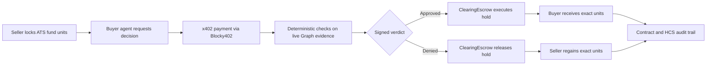

# Frontend Direction: AI Clearing Desk

Status: implementation handoff
Canonical architecture: [`docs/plans/ai-clearing-desk.md`](plans/ai-clearing-desk.md)

## Product in one sentence

An autonomous buyer pays for a live-data decision that either executes or releases one held trade of ATS-issued private-credit fund units on Hedera.

The frontend is an observability surface for a real clearing workflow. It must not present the product as an AI-managed vault, a generic compliance dashboard, or an agent with custody of investor assets.

## Demo instrument and actors

- **Instrument:** testnet units in a named private-credit fund issued through Hedera Asset Tokenization Studio (ATS).
- **Seller:** owns fund units and places an exact amount on hold for one buyer.
- **Buyer agent:** pays the x402 charge and submits the resulting authorization.
- **Clearing service:** evaluates deterministic policy checks using live Graph evidence and signs an action-bound verdict.
- **ClearingEscrow:** executes or releases the exact ATS hold. The agent cannot transfer arbitrary units.
- **DeepSeek:** explains the fixed result in plain language. Its text never determines the verdict.

## Primary user flow

1. The seller creates an ATS hold containing the security, partition, seller, buyer, amount, expiry, and `ClearingEscrow` address.
2. The new trade appears as **Held · awaiting decision**. The UI proves that the units are locked before evaluation starts.
3. The buyer agent requests a verdict and receives an x402 payment challenge.
4. The agent validates the network, asset, amount, payee, and facilitator, then pays through Blocky402.
5. The clearing service queries verified live Graph deployments and evaluates deterministic checks.
6. The service returns a signed verdict bound to this hold, buyer, amount, policy, evidence, payment, expiry, and nonce. DeepSeek adds a non-authoritative explanation.
7. `ClearingEscrow` verifies and consumes the verdict once:
   - **Approved:** execute the ATS hold; units move to the named buyer.
   - **Denied:** release the ATS hold; units return to the seller's available balance.
8. The detail view confirms the final ATS state, contract event, x402 payment reference, Hedera transaction, and HCS audit record.



## Information architecture

### 1. Clearing desk (`/`)

The homepage should explain the product and show live trade state, not generic protocol conformance.

- Hero: **Private-credit trades that clear only after proof.**
- Supporting copy: **A seller locks ATS fund units. A buyer agent pays for a live-data verdict. The clearing contract executes or releases that exact hold.**
- Primary action: **View clearing desk**.
- Four proof metrics backed by the API:
  - trades awaiting decision;
  - holds executed;
  - holds released;
  - median clearing time.
- Trade cards show instrument, seller → buyer, unit amount, hold expiry, lifecycle state, and decision price.
- Activity stream shows lifecycle events for a selected trade in chronological order.
- Architecture/proof section explains ATS hold, x402 payment, Graph evidence, contract enforcement, and HCS audit.

Do not retain hard-coded percentages, deployment counts, or transaction totals when the API has no corresponding evidence.

### 2. Trade detail (`/trades/:tradeDigest`)

The detail page is the primary demo screen.

- **Trade:** fund name, security address, partition, hold ID, seller, buyer, units, created time, expiry.
- **Lifecycle:** hold created → payment settled → evidence evaluated → verdict signed → executed/released → audit anchored.
- **Decision:** approved or denied, authoritative deterministic checks, policy hash, evidence hash, signer, issued-at, verdict expiry, and nonce-consumed state.
- **Explanation:** clearly labelled **AI explanation · not used to determine outcome**.
- **Settlement:** x402 price and payment reference, Blocky402 facilitator, Hedera transaction ID, final ATS hold state.
- **Verification links:** HashScan links for the ATS security, `ClearingEscrow`, payment transaction, settlement transaction, and HCS topic where available.
- **Copy actions:** trade digest, evidence hash, and transaction IDs.

Never label a denied trade as having “no Hedera transaction”: release is a real Hedera lifecycle operation and should show its transaction ID. Distinguish payment settlement from ATS settlement.

### 3. Instrument detail (`/instruments/:securityAddress`)

This may be a section or modal for the hackathon build, rather than a separate route.

- fund name and **testnet demo instrument** badge;
- ATS security address and standard;
- issuer address;
- unit symbol, supply, and what one unit represents;
- KYC and transfer restrictions;
- HashScan/source verification links;
- issued, held, available, and transferred unit totals when supported by authoritative reads.

## State model

Keep lifecycle state separate from verdict. A trade can be paid or evaluated before it has a verdict, and an approved verdict can exist before execution is final.

```ts
type TradeState =
  | "HOLD_PENDING"
  | "PAYMENT_REQUIRED"
  | "PAYMENT_SETTLED"
  | "EVALUATING"
  | "APPROVED"
  | "DENIED"
  | "EXECUTING"
  | "RELEASING"
  | "EXECUTED"
  | "RELEASED"
  | "EXPIRED"
  | "FAILED";

type Verdict = "APPROVE" | "DENY" | null;
```

Display language:

| API state | User-facing label | Meaning |
|---|---|---|
| `HOLD_PENDING` | Held · awaiting agent | Units are locked for this buyer. |
| `PAYMENT_REQUIRED` | Decision payment required | The x402 challenge is available. |
| `PAYMENT_SETTLED` | Decision purchased | Blocky402 settlement is confirmed. |
| `EVALUATING` | Checking live evidence | Deterministic checks are running. |
| `APPROVED` | Approved · awaiting execution | Signed approval exists; units have not moved yet. |
| `DENIED` | Denied · awaiting release | Signed denial exists; units remain held. |
| `EXECUTING` | Executing hold | Contract transaction is pending finality. |
| `RELEASING` | Releasing hold | Release transaction is pending finality. |
| `EXECUTED` | Cleared | The exact units reached the buyer. |
| `RELEASED` | Released | No units reached the buyer; seller regained availability. |
| `EXPIRED` | Hold expired | The decision window closed without settlement. |
| `FAILED` | Action required | Show a safe public error and last confirmed state. |

Use neutral styling for pending states, green only for `EXECUTED`, and red/amber for `DENIED`, `RELEASED`, `EXPIRED`, or `FAILED`. Approval is not final settlement.

## Frontend API contract

These are target read models for the backend workstream. They supersede `packages/web/src/data/decisions.ts`; the frontend must not adapt the existing fixture into production state.

### Endpoints

- `GET /api/v1/trades?limit=20&cursor=...` → ordered trade summaries plus next cursor.
- `GET /api/v1/trades/:tradeDigest` → complete trade, decision, settlement, and audit state.
- `GET /api/v1/instruments/:securityAddress` → ATS instrument metadata and verified links.
- `GET /api/v1/trades/:tradeDigest/events` → ordered lifecycle events; polling is sufficient for the demo.
- `GET /health` → service health only; do not infer Graph, ATS, or Blocky402 readiness from this endpoint.

Mutating seller and buyer-agent operations are not part of the initial public frontend contract. If demo controls are added later, they must call real backend actions and show wallet confirmation; never simulate progress with timers.

### Trade read model

```ts
type Trade = {
  tradeDigest: `0x${string}`;
  sequence: string;
  state: TradeState;
  verdict: "APPROVE" | "DENY" | null;
  instrument: {
    name: string;
    symbol: string;
    securityAddress: `0x${string}`;
    partition: `0x${string}`;
    network: "hedera-testnet";
  };
  hold: {
    holdId: string;
    seller: `0x${string}`;
    buyer: `0x${string}`;
    escrow: `0x${string}`;
    units: string;
    createdAt: string;
    expiresAt: string;
  };
  payment: null | {
    status: "REQUIRED" | "SETTLED" | "FAILED";
    asset: string;
    amount: string;
    facilitator: "Blocky402";
    reference: string | null;
    transactionId: string | null;
  };
  decision: null | {
    policyHash: `0x${string}`;
    evidenceHash: `0x${string}`;
    signer: `0x${string}`;
    issuedAt: string;
    expiresAt: string;
    nonce: string;
    nonceConsumed: boolean;
    checks: Array<{
      code: string;
      label: string;
      result: "PASS" | "FAIL";
      publicValue: string;
    }>;
    explanation: string | null;
    explanationProvider: "deepseek" | null;
  };
  settlement: null | {
    action: "EXECUTE" | "RELEASE";
    transactionId: string;
    consensusAt: string;
    contractEvent: string;
    hcsTopicId: string | null;
    hcsSequenceNumber: number | null;
  };
  links: {
    security: string;
    escrow: string;
    payment: string | null;
    settlement: string | null;
    hcsTopic: string | null;
  };
  updatedAt: string;
};
```

The API must never expose private keys, provider credentials, raw Graph rows, internal prompts, or full provider error bodies. Unknown optional evidence should be `null`, not invented placeholder text.

### Lifecycle event read model

```ts
type TradeEvent = {
  id: string;
  tradeDigest: `0x${string}`;
  type:
    | "HOLD_CREATED"
    | "PAYMENT_CHALLENGED"
    | "PAYMENT_SETTLED"
    | "EVIDENCE_EVALUATED"
    | "VERDICT_SIGNED"
    | "HOLD_EXECUTED"
    | "HOLD_RELEASED"
    | "HOLD_EXPIRED"
    | "AUDIT_ANCHORED"
    | "FAILED";
  occurredAt: string;
  transactionId: string | null;
  publicDetail: string;
};
```

## Copy and terminology migration

| Remove | Replace with |
|---|---|
| Conformance Desk | AI Clearing Desk |
| protocol / deployment as the primary object | private-credit fund / ATS security |
| operation | held trade or hold lifecycle action |
| `CONFORMANT` | approved |
| `NON_CONFORMANT`, `STALE`, `DISAGREEMENT` as top-level verdicts | denied, with the failed check explaining why |
| control list released | hold executed |
| refused · no operation submitted | hold released · no units transferred |
| signal hash | evidence hash or trade digest, according to the field |
| operator policy | clearing policy |
| AI decides whether value moves | deterministic policy decides; AI explains |

KYC and control lists may appear as issuer-configured eligibility facts. Do not show the agent changing them, and remove any story in which unblocking an address is the consequence of a verdict.

## Loading, failure, and truthfulness rules

- Render skeletons while fetching; never show fixture trades while an API request is pending.
- Show **Backend unavailable** when live state cannot be fetched, with the last successful timestamp if cached state is intentionally supported.
- A failed Graph read produces a denied decision or failed evaluation according to backend state; the frontend must not reinterpret it.
- Do not advance lifecycle state optimistically. Wait for backend confirmation derived from contract state or Mirror Node.
- Show addresses and IDs in shortened form visually, but preserve the complete value for copy and accessible labels.
- Label all assets and transactions as Hedera testnet.
- Keep DeepSeek explanation visually subordinate to authoritative checks and label it non-authoritative.

## Frontend acceptance criteria

- [ ] No production route imports the static `decisions` fixture.
- [ ] The homepage describes ATS fund-unit clearing, not generic protocol conformance or an AI vault.
- [ ] A user can distinguish the seller, buyer agent, clearing service, and `ClearingEscrow` responsibilities.
- [ ] Trade cards show real instrument, hold, amount, expiry, state, and price data from the API.
- [ ] The detail page separately identifies the x402 payment transaction and ATS execute/release transaction.
- [ ] Approved-but-unexecuted is not displayed as cleared.
- [ ] A denied demo shows a real release transaction and explicitly confirms that no units reached the buyer.
- [ ] An approved demo shows the exact held amount reaching the named buyer.
- [ ] The explanation is labelled non-authoritative and cannot obscure failed deterministic checks.
- [ ] HashScan links are generated only from backend-provided, allow-listed testnet identifiers.
- [ ] Refreshing a route reconstructs the same state from the API; animation timers do not manufacture progress.
- [ ] Empty, loading, unavailable, expired, denied, released, executed, and failed states each have explicit UI coverage.
- [ ] Component tests cover state labels, settlement separation, missing optional audit data, and safe external links.
- [ ] One browser test follows an approved trade from hold through execution; another follows a denied trade through release.

## Out of scope for this frontend pass

- portfolio management, deposits, withdrawals, NAV, yield, or fund strategy;
- investor onboarding or KYC administration;
- changing ATS control lists or privileged roles;
- displaying raw Graph records or model prompts;
- claiming decentralization, autonomous asset management, or legal compliance certification;
- Privy wallet integration until its Hedera signing compatibility proof is complete.
