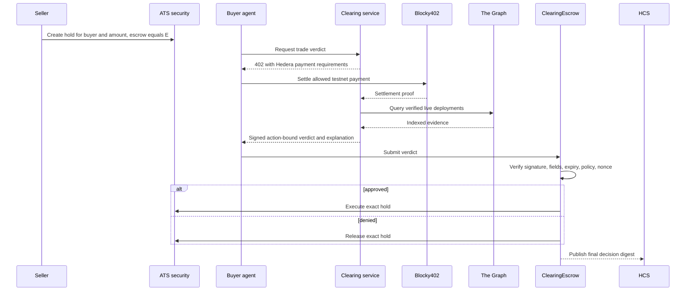

# AI Clearing Desk for ATS Fund-Unit Trades

## Goal Capsule

- **Objective:** A holder can place ATS-issued fund units into a trade hold, and an autonomous buyer can purchase a live-data clearing decision that either executes the exact held transfer or releases it without giving the agent unilateral custody or issuer powers.
- **Means:** Make a policy-enforcing smart contract the ATS hold escrow, bind each signed verdict to one immutable trade, and keep the model explanatory rather than authoritative. (KTD1, KTD2, KTD3)
- **Authority:** This plan supersedes the post-transfer control-list flow in `.context/PLAN-ARCHITECTURE.md`, `docs/E2E.md`, and the current `ConformanceGate.record` behavior.
- **Execution profile:** Backend, contracts, live testnet integration, and documentation. Frontend implementation remains owned by the separate frontend workstream; this plan defines only its API and state contract.
- **Stop conditions:** Do not claim the Tokenization track until a real ATS asset and lifecycle operation are visible on testnet. Do not claim Agentic Payments until Blocky402 settles a real x402 request. Do not ship an operator-key fallback that can bypass the clearing contract.

---

## Product Contract

### Summary

The product is not an AI-managed vault and ATS units are not decorative governance shares. It is a small secondary-market clearing desk for a tokenized private-credit fund: a seller locks ATS fund units for a named buyer, an agent pays for a live conformance decision, and the escrow contract executes or releases that exact hold.

This gives every mechanism a job. ATS represents and constrains the real security; holds remove seller double-spend risk while a trade is checked; The Graph supplies live external market evidence; x402 makes the decision a service an agent can autonomously buy; the deterministic policy decides; DeepSeek explains the result; HCS and contract events make the outcome replayable.

### Actors

- A1. **Issuer:** Creates the ATS fund-unit security and configures KYC and transfer restrictions.
- A2. **Seller:** Owns units and creates a hold naming the buyer, amount, expiry, and clearing escrow.
- A3. **Buyer agent:** Has a bounded payment budget and asks the clearing service to evaluate the pending trade.
- A4. **Clearing service:** Holds The Graph credential and verdict-signing key, computes deterministic checks, and returns an action-bound signed verdict after x402 settlement.
- A5. **Clearing escrow contract:** Is the hold's only escrow address and therefore the only caller that can execute or release it.
- A6. **DeepSeek:** Produces a human-readable explanation from already-computed checks; it has no signing, role, custody, or verdict authority.

### Requirements

**Instrument and trade lifecycle**

- R1. Issue or reuse one ATS security that represents units in a named private-credit fund, with documented issuer, supply, unit meaning, KYC policy, and transfer restrictions.
- R2. A seller creates an ATS hold for a specific buyer, amount, expiration, and `ClearingEscrow` contract address.
- R3. The held amount is unavailable for any other transfer while the decision is pending.
- R4. An approved trade executes directly from the hold; a denied trade releases the hold; an expired trade is reclaimed through the ATS lifecycle.

**Decision integrity**

- R5. A verdict commits to chain ID, ATS security address, partition, seller, buyer, amount, hold ID, expiry, policy hash, evidence hash, payment reference, issued-at time, and nonce.
- R6. The deterministic policy is authoritative and fails closed for invalid deployments, indexing errors, stale evidence, schema mismatch, invariant failure, signer mismatch, expiry, or replay.
- R7. DeepSeek may summarize checks and risks but cannot turn a denial into approval or alter any action-bound field.
- R8. `ClearingEscrow` verifies the complete authorization, consumes its nonce once, and calls the ATS hold function atomically. No agent EOA receives issuer, controller, KYC, control-list, clearing-validator, or escrow authority.

**Paid live evidence**

- R9. The service is x402-gated on Hedera testnet and settles through Blocky402 before returning a verdict.
- R10. The buyer rejects unexpected network, token, payee, facilitator, scheme, or price before signing a payment.
- R11. The Graph reads use currently valid live deployment IDs. Raw Gateway rows and credentials never leave the seller service.
- R12. The response exposes derived checks, evidence hashes, pinned deployment identifiers, and observed block metadata so a decision can be audited without reselling Gateway access.

**Audit and product surface**

- R13. Every final decision emits a contract event and an HCS record that share the trade digest, verdict, evidence hash, payment reference, and resulting Hedera transaction ID.
- R14. A replay command independently verifies signatures, digests, HCS messages, contract events, and final ATS hold state.
- R15. The API exposes real pending, approved, denied, released, executed, expired, and failed states for the separate frontend workstream; static fixtures are not accepted as production state.
- R16. README and partner writeups describe ATS as ERC-1400 with partial ERC-3643 support and distinguish an AI clearing service from a decentralized oracle or autonomous fund manager.

### Key Flows

- F1. **Approved trade**
  - **Trigger:** Seller creates a hold with `ClearingEscrow` as escrow.
  - **Steps:** Buyer agent receives 402, validates terms, pays through Blocky402, receives and verifies a signed approval, then submits it to `ClearingEscrow`, which consumes the authorization and executes the exact ATS hold.
  - **Outcome:** Buyer balance rises by the held amount, seller held balance falls, and matching contract/HCS evidence exists.
  - **Covered by:** R2-R13
- F2. **Denied trade**
  - **Trigger:** Any mandatory live-data or policy check fails.
  - **Steps:** Service signs a denial bound to the trade; DeepSeek explains it; `ClearingEscrow` verifies the denial and releases the hold.
  - **Outcome:** No units move to the buyer, the seller regains availability, and the denial remains auditable.
  - **Covered by:** R4-R7, R11-R14
- F3. **Hostile or stale authorization**
  - **Trigger:** Caller changes the buyer, amount, hold, evidence, expiry, policy, or reuses a nonce.
  - **Outcome:** The contract reverts before any ATS mutation.
  - **Covered by:** R5, R6, R8

### Acceptance Examples

- AE1. Given a valid live Graph decision and settled x402 payment, when the buyer agent submits the approval, then one exact ATS hold is executed and the authorization cannot be replayed.
- AE2. Given stale or invalid Graph evidence, when the trade is evaluated, then the hold is released and there is no transfer to the buyer.
- AE3. Given DeepSeek recommends approval while deterministic checks deny, when the response is assembled, then the service returns denial and records the model conflict.
- AE4. Given a valid signature for trade A, when it is submitted for trade B, then `ClearingEscrow` rejects it with no state change.

### Scope Boundaries

- No pooled asset management, yield strategy, deposits, redemptions, NAV accounting, or promise of investment returns.
- No fake multisignature. The safety property comes from the ATS hold naming a contract as its sole escrow and from action-bound authorization, not from several keys owned by the same application.
- KYC and control lists remain issuer-configured eligibility prerequisites; the agent does not add or remove investors to make a trade pass.
- No mainnet funds or paid provider plans. All external mutations are testnet-only.
- No frontend changes in this execution plan.

---

## Planning Contract

### Key Technical Decisions

- KTD1. **Use ATS holds as the settlement primitive.** The current unblock-then-transfer sequence is replaced because it gives an operator excessive authority and makes the verdict post-hoc. ATS hold execution already requires the recorded escrow caller, so a contract escrow can enforce the decision before units move.
- KTD2. **Use one action-bound verdict, not a multisig.** The clearing service signs a typed payload for one hold. The contract verifies all fields and consumes the nonce. Key rotation and signer governance are issuer actions, but no quorum is presented as decentralization.
- KTD3. **Keep AI outside the trust boundary.** Deterministic checks produce the verdict. DeepSeek only explains the fixed result through a provider-neutral reasoner interface.
- KTD4. **Separate seller and buyer processes.** `packages/service` owns Graph and verdict credentials; `packages/agent` owns the testnet payment key. The agent never receives raw Graph data or the Graph credential.
- KTD5. **Fail the catalog closed.** The six deployment IDs currently in `packages/signal/src/deployments.ts` failed the live Gateway probe and must be replaced with verified current IDs before any live demo can pass.
- KTD6. **Audit after finality, not in the payment hot path.** Contract execution is the authority. HCS is an independently replayable audit record written after the final ATS outcome and reported as degraded if anchoring fails.

### Architecture

### Sequencing

`U1 -> U2 -> U3 -> U4 -> U5 -> U6 -> U7`. U2 is the architectural proof: if a deployed contract cannot be recorded as ATS escrow and call both execute and release, stop rather than reintroducing a privileged agent key.

### External Preconditions

- Existing Graph Studio key, never committed or printed.
- One funded Hedera testnet ECDSA operator account for deployment and issuer setup, plus distinct seller and buyer testnet accounts. These are test fixtures and fee payers, not production custodians.
- Testnet HBAR and the exact settlement asset required by Blocky402.
- DeepSeek API key and explicit model name before live explanation tests; deterministic tests do not depend on it.
- Current ATS factory and resolver configuration verified on testnet before deployment.

---

## Implementation Units

### U1. Replace the stale product contract

- **Goal:** Make the repo consistently describe the clearing-desk flow and remove Anthropic and post-transfer control-list assumptions.
- **Files:** `README.md`, `.env.example`, `docs/E2E.md`, `packages/agent/src/reason.cjs`, `packages/agent/src/config.cjs`, `packages/agent/test/reason.test.cjs`
- **Work:** Introduce provider-neutral reasoning with DeepSeek configuration; update terminology, environment validation, and test expectations. Do not make the model authoritative.
- **Test scenarios:** Missing DeepSeek configuration fails only the explanation path; deterministic decision still cannot be overridden; no tracked file contains an Anthropic variable.
- **Verification:** `npm test --workspace @desk/agent` and `rg -n "ANTHROPIC|removeFromControlList" README.md .env.example docs packages/agent` return no product-path matches.

### U2. Prove contract escrow against ATS

- **Goal:** Validate the non-bypassable settlement primitive before rewriting the agent.
- **Files:** `contracts/src/ClearingEscrow.sol`, `contracts/test/ClearingEscrow.t.sol`, `contracts/script/DeployClearingEscrow.s.sol`, `scripts/issue-equity.cjs`, `packages/agent/src/ats.cjs`
- **Work:** Implement the minimal ATS hold interface, typed verdict hashing, signer verification, expiry and nonce checks, and atomic execute/release calls. Run one testnet spike with the contract recorded as escrow.
- **Test scenarios:** Contract executes a valid hold; contract releases a denied hold; an EOA cannot execute or release; changed trade fields, expired verdict, wrong signer, and replay all revert.
- **Verification:** `npm run test:contracts`; Mirror Node and ATS reads prove the escrow address and final hold state on testnet.

### U3. Repair the live Graph evidence catalog

- **Goal:** Replace invalid hardcoded deployment IDs with a live-verified, reproducible registry.
- **Files:** `packages/signal/src/deployments.ts`, `packages/signal/src/graph.ts`, `packages/signal/src/mcp.ts`, `packages/signal/test/deployments.test.ts`, `scripts/sweep.cjs`
- **Work:** Discover current standardized deployments, pin IDs and schema versions, record verification metadata, and add a fail-closed health sweep. Keep cross-chain comparisons to schema and per-deployment invariants rather than pretending values should match across chains.
- **Test scenarios:** Every configured ID resolves live; `_meta.deployment` matches; invalid, stale, indexing-error, and schema-drift cases deny; raw rows and credentials are absent from the derived response.
- **Verification:** `npm test --workspace @desk/signal` plus a redacted live sweep stored under `.context/e2e/<run-id>/graph.json`.

### U4. Bind the paid verdict to the held trade

- **Goal:** Make the x402 purchase return a verdict that the contract can safely consume once.
- **Files:** `packages/signal/src/types.ts`, `packages/signal/src/sign.ts`, `packages/service/src/types.ts`, `packages/service/src/evaluator.ts`, `packages/service/src/server.ts`, `packages/agent/src/x402-buyer.cjs`, `packages/agent/src/decision.cjs`
- **Work:** Add all R5 fields to canonical typed data, verify payment terms and settlement, sign only after live evidence is computed, and remove generic operation records.
- **Test scenarios:** Approved and denied verdicts round-trip; tampered trade or payment fields fail; settlement failure returns no verdict; one payment cannot buy two verdicts.
- **Verification:** `npm test --workspace @desk/signal --workspace @desk/service --workspace @desk/agent`.

### U5. Replace the caretaker loop with a clearing state machine

- **Goal:** Orchestrate create-hold, pay, verify, execute-or-release, finality confirmation, and audit without privileged shortcuts.
- **Files:** `packages/agent/src/index.cjs`, `packages/agent/src/decision.cjs`, `packages/agent/src/hedera.cjs`, `scripts/run-caretaker.cjs`, `scripts/replay.cjs`
- **Work:** Introduce explicit states and idempotent resume behavior. Confirm each mutation through contract state or Mirror Node before advancing.
- **Test scenarios:** Happy path executes once; denial releases; crash after payment resumes without repaying; crash after execution does not re-execute; audit failure is reported without falsifying settlement state.
- **Verification:** `npm test --workspace @desk/agent` and both live approved and denied testnet runs.

### U6. Expose reusable state and update the frontend contract

- **Goal:** Let CLI, MCP, and the separate frontend consume the same real trade state.
- **Files:** `packages/cli/src/client.ts`, `packages/mcp-server/src/server.ts`, `packages/service/src/server.ts`, `packages/web/src/data/decisions.ts`, `docs/E2E.md`
- **Work:** Add read-only trade and evidence endpoints plus stable schemas. Replace the web fixture only at the API boundary or hand the schema to the frontend owner; do not redesign UI here.
- **Test scenarios:** CLI and MCP return the same digest and state; secrets and raw Graph rows are absent; pending through final states serialize consistently.
- **Verification:** `npm test --workspace @desk/cli --workspace @desk/mcp-server --workspace @desk/service`.

### U7. Run the qualification evidence matrix

- **Goal:** Produce honest, judge-verifiable evidence for both relevant Hedera tracks.
- **Files:** `README.md`, `HEDERA-FEEDBACK.md`, `docs/E2E.md`, `specs/`, `prompts/`, `.context/e2e/<run-id>/`
- **Work:** Run clean offline gates and live testnet flows; verify our applicable contract on HashScan/Sourcify; record x402 settlement, ATS issuance/configuration/hold lifecycle, and replay output; document AI-generated files.
- **Test scenarios:** Fresh-clone setup, approved trade, denied trade, replay attack, model conflict, invalid Graph catalog, Blocky402 failure, HCS degradation.
- **Verification:** Complete every row in the Verification Contract with identifiers and redacted evidence.

---

## Verification Contract

| Gate | Command or evidence | Covers |
|---|---|---|
| Clean build | `npm ci --ignore-scripts && npm run build` | U1-U6 |
| Node tests | `npm test` | U1, U3-U6 |
| Solidity tests | `npm run test:contracts` | U2, U4 |
| Static secret/provider scan | `rg -n "ANTHROPIC|GRAPH_STUDIO_KEY=.*[^=]|HEDERA_OPERATOR_KEY=.*[^=]" --glob '!package-lock.json' .` reviewed with no secret values or Anthropic dependency | U1, U7 |
| Live Graph | Every configured deployment resolves and returns matching `_meta.deployment`; evidence is redacted | U3 |
| Live x402 | Mirror Node proves one Blocky402-settled paid request with expected asset, amount, sender, and payee | U4, U7 |
| Live ATS denial | Hold is released and buyer balance does not change | U2, U5, U7 |
| Live ATS approval | Exact hold amount moves once to the named buyer | U2, U5, U7 |
| Replay | Duplicate nonce and altered action fields revert; HCS and contract records recompute | U2, U5, U7 |
| Track documentation | Public README explains setup, architecture, payment flow, issuance, configuration, and lifecycle operation; video remains within the stricter ETHGlobal limit | U7 |

---

## Definition of Done

- D1. The old unblock-then-transfer and post-operation `ConformanceGate.record` path is gone from executable code and judged documentation.
- D2. An ATS fund-unit security exists on Hedera testnet with issuer configuration, KYC/transfer policy, and a demonstrated hold lifecycle.
- D3. `ClearingEscrow` is the recorded ATS escrow and no agent-controlled EOA can bypass its verdict checks.
- D4. A live Blocky402 x402 payment buys one action-bound verdict end to end.
- D5. Current live Graph deployments produce the signed derived evidence; invalid catalog entries fail closed.
- D6. DeepSeek explains decisions but cannot change them, sign them, or control assets.
- D7. Approved, denied, hostile, expired, replayed, and interrupted flows pass offline and proportional live tests.
- D8. Contract events, HCS messages, Mirror Node state, and ATS balances agree for the demo runs.
- D9. Public documentation meets the AI & Agentic Payments and Tokenization of Anything qualification requirements without claiming Harness or Continuity eligibility.
- D10. The repo is pushed through reviewed, green PRs to `main`; merge, CI, deployment, and live testnet evidence are reported separately.

---

## Appendix

### Hedera Track Mapping

| Track | Pool | Required proof | Project fit |
|---|---:|---|---|
| AI & Agentic Payments on Hedera | $6,000, up to 3 x $2,000 | Live x402-gated service on Hedera settled through Blocky402; consuming agent; one real paid request; public repo and payment-flow README; demo no longer than five minutes | Primary. The agent buys the action-bound clearing verdict. |
| Tokenization of Anything | $6,000, up to 3 x $2,000 | ATS-issued or managed asset; Hedera testnet deployment; public repo and applicable HashScan verification; issuance, configuration, and one lifecycle operation in a demo no longer than five minutes | Primary. The fund units and execute-or-release hold are the product. |
| Open Source - Improve the Hedera Harness | $2,000, up to 2 x $1,000 | Meaningful Harness contribution or new directly inspired harness; public repo or PR with run instructions; working demo no longer than five minutes | Not targeted. Product tests do not qualify by themselves. |
| Continuity | $1,000 | Existing Hedera project plus substantive new event work, clear before/after history, public repo, focused demo | Ineligible for this From Scratch submission. |

The current official source is `https://ethglobal.com/events/ethonline2026/prizes` and must be rechecked before final submission because sponsor wording can change.
